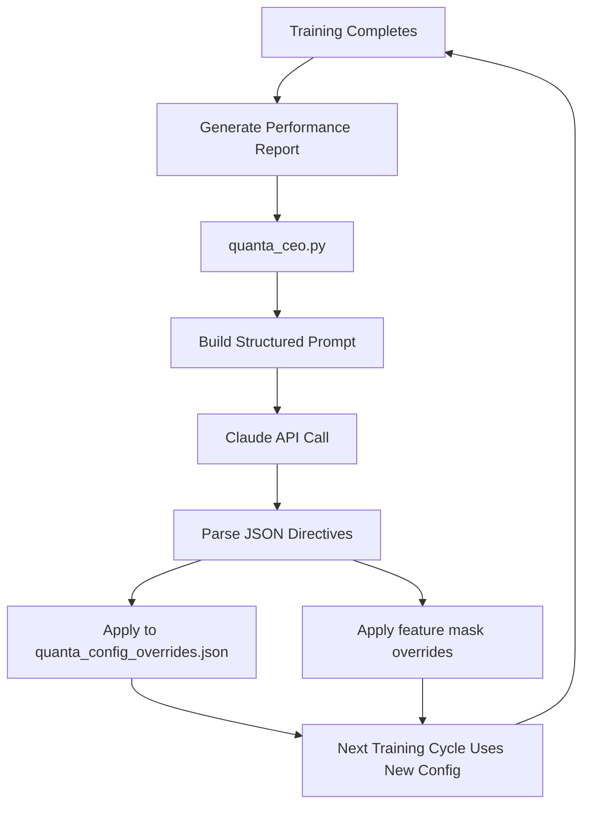

# QUANTA CEO — LLM Training Evaluator via Claude API

An autonomous AI supervisor that evaluates all 7 specialist agents after every training cycle, diagnoses performance issues, and auto-applies corrective hyperparameter + feature mask changes for the next cycle.

## Architecture Overview



## User Review Required

> [!IMPORTANT]
> **API Key needed.** You'll need a Claude API key (from console.anthropic.com). This is different from your Opus Pro subscription — the API is billed separately per token. A single CEO evaluation costs approximately **$0.03-0.08** per cycle. If you retrain once per day, that's ~$1-2/month.

> [!WARNING]  
> **Full autonomy means risk.** The CEO will auto-apply changes without human approval. We will implement hard guardrails (e.g., learning rate can never exceed 0.5, depth never exceeds 10, feature masks must keep ≥50 features) to prevent the AI from destabilizing the system.

## Proposed Changes

---

### [NEW] `quanta_ceo.py` — The CEO Module (~250 lines)

The core brain. Contains:

1. **`collect_training_report(ml_engine)`** — After training, scrapes all 7 agents for:
   - Per-agent: generation, val_auc, val_brier, train_acc, val_acc, num_samples, feature_mask name, hyperparams (iterations/lr/depth), ensemble weight, importance_mask stats (how many features were pruned)
   - Global: total training time, regime routing table, Brier scores, drift alerts
   - Feature importance: top 10 most important feature indices per agent (from CatBoost `LossFunctionChange`)

2. **`build_ceo_prompt(report)`** — Constructs a structured prompt containing:
   - System prompt defining the CEO's role and constraints
   - The full performance report as structured data
   - A strict JSON output schema the CEO must follow
   - Hard guardrails (min/max bounds for every tunable parameter)

3. **`call_claude(prompt)`** — Sends the prompt to Claude API via `anthropic` Python SDK. Uses `claude-sonnet-4-20250514` (fast + smart enough for this task, cheaper than Opus).

4. **`apply_directives(directives)`** — Parses the CEO's JSON response and:
   - Updates `quanta_config_overrides.json` for config-level changes (event extraction params, risk settings, training pipeline params)
   - Updates an agent-level override file `ceo_agent_overrides.json` for per-agent changes (hyperparams, feature mask modifications, ensemble weight hints, regime routing adjustments)
   - Logs every change to `ceo_audit_log.jsonl` for full traceability

---

### [MODIFY] `QUANTA_ml_engine.py`

Two surgical insertion points:

1. **After training completes** (line ~5087, after "Total training time" print):
   - Call `quanta_ceo.evaluate_post_training(self)` 
   - This triggers the entire CEO pipeline asynchronously

2. **Before training starts** (line ~4341, inside `train()`):
   - Load `ceo_agent_overrides.json` if it exists
   - Apply per-agent hyperparameter overrides (iterations, lr, depth, l2, etc.)
   - Apply feature mask modifications (add/remove specific feature indices from domain masks)

---

### [MODIFY] `quanta_config.py`

- Add `CEOConfig` dataclass with:
  - `anthropic_api_key: str` (loaded from env var `ANTHROPIC_API_KEY`)
  - `model: str = "claude-sonnet-4-20250514"`
  - `enabled: bool = True`
  - `max_changes_per_cycle: int = 5` (safety: CEO can't change more than 5 things at once)
  - `guardrail_bounds: dict` (min/max for every tunable parameter)

---

### [MODIFY] `templates/dashboard.html`

- Add a "CEO Audit Log" section to the System or Settings tab showing:
  - Last evaluation timestamp
  - What the CEO changed and why (human-readable summary)
  - Link to full audit log

---

## CEO Output Schema (What Claude Returns)

```json
{
  "analysis": "Brief text summary of findings",
  "agent_changes": {
    "ares": {
      "hyperparams": {"learning_rate": 0.12, "depth": 6},
      "feature_mask_add": [193, 194, 195],
      "feature_mask_remove": [87, 88],
      "reasoning": "Ares over-relied on spike-dump features in a low-vol month. Adding VPIN features and removing noisy spike indicators."
    }
  },
  "config_changes": {
    "events": {"ares_cusum_mult": 1.0},
    "risk_manager": {"max_risk_per_trade_pct": 25.0}
  },
  "regime_routing_changes": {
    "hermes": [0.4, 1.0, 0.2]
  },
  "warnings": ["Chronos has only 47 training samples — consider lowering min_events_per_specialist"]
}
```

## Guardrails (Hard Limits the CEO Cannot Exceed)

| Parameter | Min | Max |
|-----------|-----|-----|
| CatBoost iterations | 200 | 3000 |
| CatBoost learning_rate | 0.01 | 0.5 |
| CatBoost depth | 3 | 10 |
| Feature mask size | 50 | 278 |
| Ensemble weight | 0.05 | 0.30 |
| Regime routing multiplier | 0.0 | 1.5 |
| max_risk_per_trade_pct | 1.0 | 50.0 |
| CUSUM multipliers | 0.1 | 5.0 |

## Open Questions

> [!IMPORTANT]
> **Which Claude model?** `claude-sonnet-4-20250514` is the sweet spot (fast, smart, cheap at ~$0.03/eval). Full Opus would cost ~$0.15/eval but has deeper reasoning. Which do you prefer?

> [!IMPORTANT]
> **API Key storage.** I'll read from environment variable `ANTHROPIC_API_KEY`. You'll need to set this on your Windows system. Is that acceptable?

## Verification Plan

1. Run a mock CEO evaluation with fake training data to verify prompt → response → JSON parsing pipeline works end-to-end
2. Verify guardrails by feeding the CEO a prompt that tries to set learning_rate to 999 and confirming it gets clamped
3. Verify `ceo_agent_overrides.json` is correctly loaded on the next training cycle
4. Check dashboard shows the CEO's reasoning in the audit log
